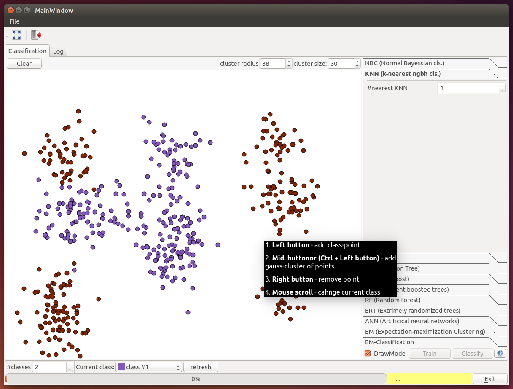
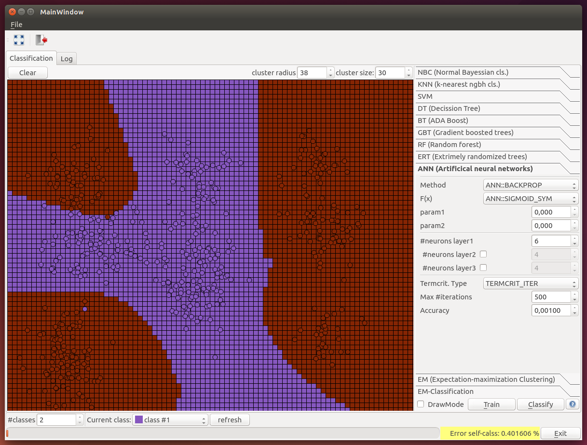
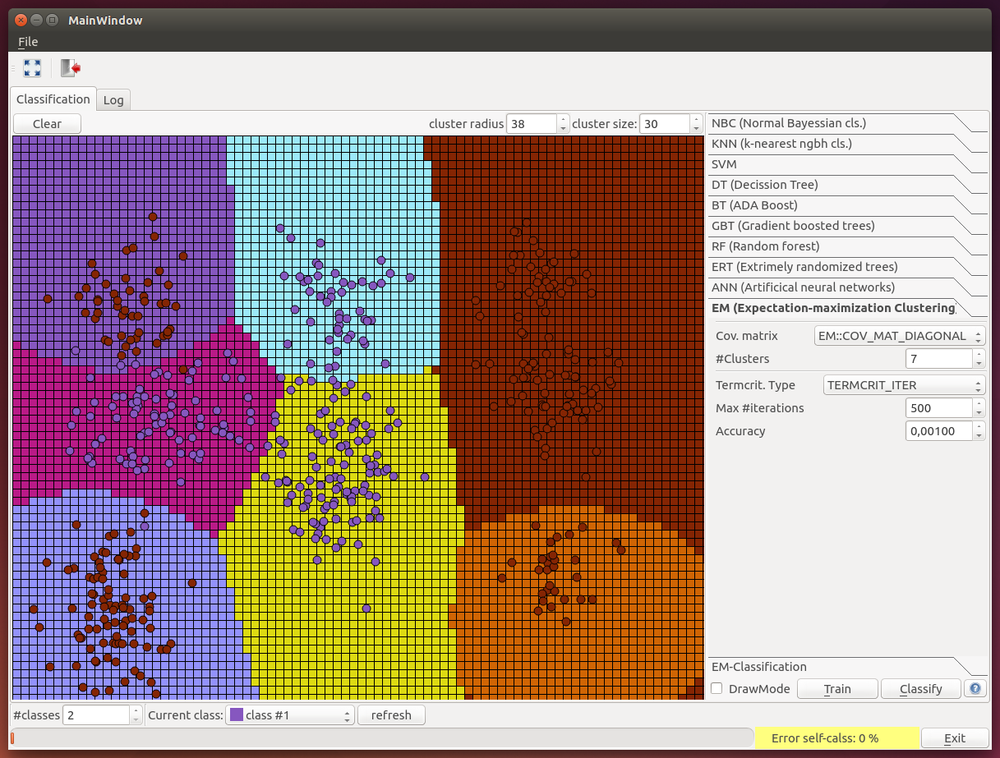

OpenCVClassifiersQtExample
==========================

QtGUI OpenCV ml-classifiers

Examples of classifiers:
  - Normal Bayes Classifier
  - K-Nearest Neighbors
  - Support Vector Machines
  - Decision Trees
  - Boosting (boosted tree)
  - Gradient Boosted Trees
  - Random Trees (Random Forests)
  - Extremely randomized trees
  - Neural Networks (MLP)
  - Expectation Maximization (clusterization/classification)
(for help see http://docs.opencv.org/modules/ml/doc/ml.html)

Require:
  - OpenCV
  - Qt5/Qt4

Build:
  - ... install qt-dev, opencv-dev
  - $ cd OpenCVClassifiersQtExample
  - $ mkdir build
  - $ cd build
  - $ cmake ..
  - $ make -j6
  - $ ./ExampleOpenCVClassifiersQt_Debug
  - ... Classify!

Author:  
    Kalinovsky Alexander (gakarak)  
    --  
    Based on examples from OpenCV/samples  

